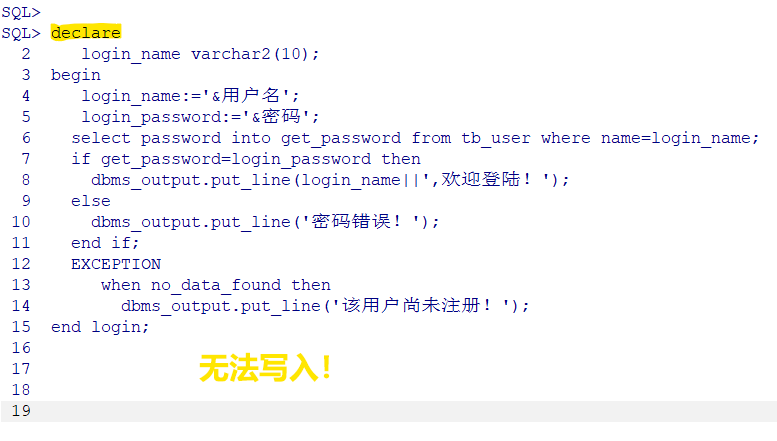

# Oracle practical training

By:Benin

---

## ❌ What I Did .

## ✌️ What I Learnt ?

## ✔️ What I Done !

---

# ❌ What I Did .

---

# install & unstall

Oracle & PL/SQL developer for time to time.

😭😭😭

---

# searching online

for any way to run my code.

---

# ELSE in failure

🕷️Crawl the data from Taobao.

🕸️Using Javaweb to contain data.

🤞Manage remote DB in cloud.

---

# 📘 What I Learnt ?

---

    Maybe...&nbsp;
    something&nbsp;
    for

    <h1>oracle coding!
    <h1>💻

*Tips for effiective Oracle included.

---

## Tips for Batch Coding</h2>

   Using HbuilderX to code rapidly.

---

## How to run PL/SQL code

just add a '/' after your sentences.

---

- Symmetric writing

- Slight difference about login

- Append "on delete cascade" on foreign constraint tail

---

    Maybe...&nbsp;
    something&nbsp;
    else&nbsp;
    for

    <h1>my show time
    <h1>🎉

---

# Markdown

for type setting📑

---

# Reveal.js

for PPT🎆

*Using Markdown language  to create PPT runned by explorer.*

---

# Latex

for typeset📄

*Combine two PDF file into one.*

---

# ✔️ What I Done !
    
---

## create a review note

*by using python*

---

## OUTPUT

---

## created a instance

using cloud service(<a href="https://console.cloud.tencent.com/cvm/instance/index?action=TerminateInstances&rid=33 ">cloud.tencent.com</a>) .

---

# create a simple instance

<a href="../execute.sql">execute.sql</a>

---

# thank you!

the end.